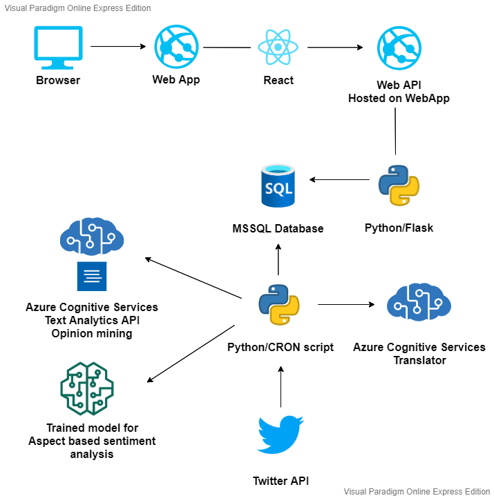

# twitter-hashtag-sentiment

- [twitter-hashtag-sentiment](#twitter-hashtag-sentiment)
  - [Description](#description)
  - [Contributors](#contributors)
    - [Filip Choromański](#filip-choromański)
    - [Bartłomiej Królak](#bartłomiej-królak)
  - [Features](#features)
  - [Solution](#solution)
    - [Architecture](#architecture)
    - [Tech Stack](#tech-stack)
  - [TODO](#todo)

## Description
Aspect based sentiment analysis of hashtags used in twitter posts using Azure services.

## Contributors

### Filip Choromański
I am student of Computer science with Data Engineering speciality on Warsaw University of Technology on faculty of Electrical Engineering. I work as ServiceNow Developer. In the free time I like to watch Premier League and select my Fantasy Premier League squad.

***GitHub*** - https://github.com/ChoromanskiFilip

### Bartłomiej Królak
Same as my friend I study computer science on Warsaw University of Technology. At the same time I work part-time as Java Deloper.

***GitHub*** - https://github.com/btqr

## Features
**Minimum viable product (MVP):**
- Showing sentiment indicator for given hashtag
- Showing example tweets with given hashtag
- Showing sentiment over time for given hashtag
- Everything is available at hosted web page

## Solution
On the welcome screen of web application user will see input field where she/he should provide hashtag for which sentiment will be determined. After user submits the hashtag, request to our first microservice will be sent. Then we will check if we have computed data for given hashtag in our database. If that's the case we will send back response with a JSON object containing sentiment score and optionally few example tweets for given input. Otherwise we will add entry with new hashtag to our database and inform user that we have no data yet for this specific hashtag but it will be gathered soon. Second microservice will repeatedly fetch tweets for hashtags that are in our database using twitter API https://developer.twitter.com/en/docs/twitter-api/v1/tweets/search/api-reference/get-search-tweets and compute their sentiment using Text Analytics API service available in Azure. These results will be continously saved to database. Both microservices will be deployed to Azure Function.
### Architecture

### Tech Stack

Microservices:
- Deployed to Azure Function
- Python
- Text Analytics API

Web Page:
- Deployed to Azure App Service (Web App)
- React

Database:
- CosmoDB

## TODO
- [ ] Prepare Python Azure Function boilerplate
- [ ] Prepare React boilerplate
- [ ] Prepare Database boilerplate
- [ ] Register developer account at twitter page and test their API
- [ ] Connect to Text Analytics API
- [ ] Prepare welcome page with input field for web app
- [ ] Deploy React app ([Deploy from VS Code](https://azure.microsoft.com/pl-pl/resources/videos/build-and-deply-nodejs-and-react-apps-with-vscode-appservice-and-cosmosdb/))
- [ ] Count sentiment for given hashtag
- [ ] Prepare react component showing sentiment score
- [ ] Prepare endpoint returning sentiment and example tweets for given hashtag